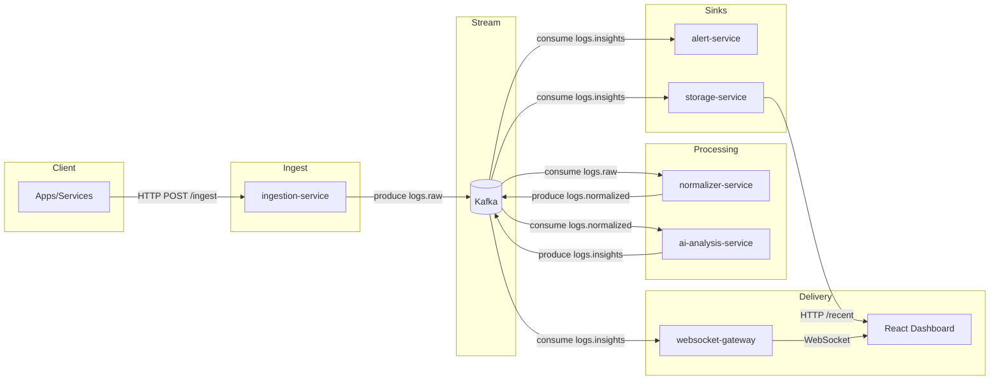
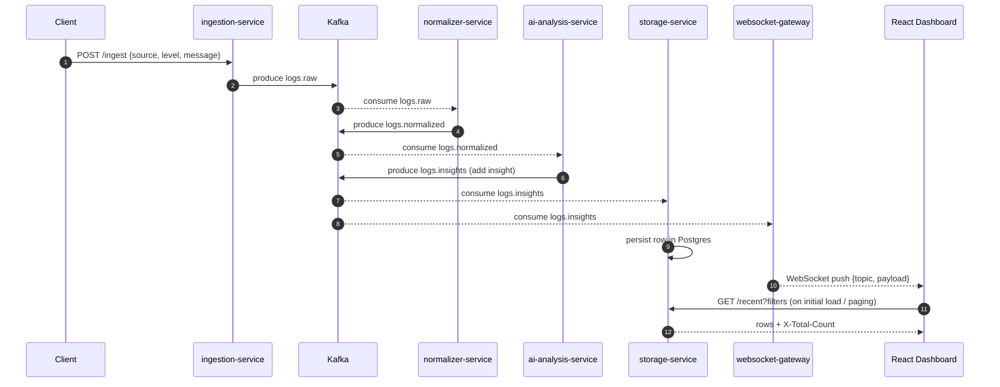

# AI Log Aggregator Architecture

This document explains the system architecture, the responsibilities of each component, data contracts, runtime topology, scaling patterns, operational concerns, and security considerations. It complements the top-level README (setup/run/debug) and the API reference in `docs/api/`.

## Goals and Non‑Goals
- Goals:
  - Ingest arbitrary application logs over HTTP quickly and reliably
  - Normalize log records and enrich with AI-driven insights
  - Fan-out to alerting and storage sinks without coupling
  - Provide real-time streaming to UI, plus historical queries
  - Be simple to run locally with Docker, yet scale with Kafka semantics
- Non‑Goals:
  - Guaranteed once-only delivery end-to-end (Kafka provides at-least-once at consumer level; services should be idempotent if necessary)
  - Full-featured alert destinations or policy engine (kept intentionally minimal)

## High-Level Overview



## Sequence Flows

### End-to-End: Ingest to Dashboard



## Components

### ingestion-service
- Purpose: Public HTTP entrypoint to enqueue logs into Kafka quickly.
- Interface: `POST /ingest` with JSON payload (validated by Zod).
- Output: Produces to topic `logs.raw`.
- Constraints: Stateless; short-lived producer connection per request for simplicity (can be optimized to reuse connections when scaling).

### normalizer-service
- Purpose: Convert raw logs to a consistent schema; enrich with derived fields if needed.
- Input: Consumes `logs.raw`.
- Output: Produces `logs.normalized`.
- Notes: Use Zod for shaping; ideal place to add tenant/source mapping, PII scrubbing, or log level harmonization.

### ai-analysis-service
- Purpose: Perform AI-assisted analysis to classify severity, summarize, or suggest remediation.
- Input: Consumes `logs.normalized`.
- Output: Produces `logs.insights`.
- Behavior: If `OPENAI_API_KEY` is not set, gracefully falls back to a default summary with `analysis_failed` (pipeline remains functional).
- Latency: Designed to be asynchronous; slow calls impact only this branch while ingestion remains decoupled.

### alert-service
- Purpose: Listen to insights and trigger alerts (stdout/webhook placeholder).
- Input: Consumes `logs.insights`.
- Extensibility: Add routes to send Slack/Email/PagerDuty; implement dedup windows, severity thresholds, etc.

### storage-service
- Purpose: Persist insights to PostgreSQL for historical queries.
- Input: Consumes `logs.insights`.
- API: `GET /recent` supports filters and paging.
- Schema:
  - Table `logs(id SERIAL, source TEXT, level TEXT, message TEXT, timestamp TIMESTAMPTZ, insight JSONB)`
- Filtering & paging:
  - Query params: `limit`, `offset`, `levels=debug,info,warn,error`, `source`, `sinceMinutes`
  - Returns JSON rows and sets `X-Total-Count` for total records matching filters.

### websocket-gateway
- Purpose: Stream real-time insights to browsers via WebSockets.
- Input: Consumes `logs.insights`.
- Output: Broadcasts JSON messages to connected clients.
- Protocol: Simple JSON `{ topic, payload }` messages; topic mirrors Kafka topic.

### React Dashboard
- Purpose: Visualize real-time and historical data with filters and charts.
- Data sources: WebSocket for live events; Storage API for history and paging.
- Features:
  - Level/source/time window filters; URL persistence
  - Paging with total counts and cached pages
  - Charts: events-over-time, error-rate, by-level, per-source throughput
  - Dark mode and polished tooltips; legend stays within panels

## Data Contracts

### Ingest payload (HTTP)
```json
{
  "source": "demo-app",
  "level": "info",
  "message": "User signed in",
  "timestamp": "2025-11-30T20:10:00.000Z", // optional; server adds if missing
  "context": { "userId": "123" }
}
```

### Kafka Topics
- `logs.raw`: As-ingested shape, minimally validated.
- `logs.normalized`: Canonical schema, consistently typed fields.
- `logs.insights`: Normalized + `insight` object, e.g. `{ summary, confidence }`.

### Storage row shape
```json
{
  "id": 42,
  "source": "demo-app",
  "level": "error",
  "message": "Database timeout",
  "timestamp": "2025-11-30T20:12:34.000Z",
  "insight": { "summary": "analysis_failed", "confidence": 0 }
}
```

### WebSocket message
```json
{
  "topic": "logs.insights",
  "payload": {
    "source": "demo-app",
    "level": "warn",
    "message": "Slow query",
    "timestamp": "2025-11-30T20:13:00.000Z",
    "insight": { "summary": "Possible index issue", "confidence": 0.6 }
  }
}
```

## Runtime Topology

All services are containerized and orchestrated by Docker Compose. Kafka and Zookeeper provide the messaging backbone. PostgreSQL backs historical queries. The dashboard connects to the WebSocket gateway (`ws://localhost:8080`) and storage API (`http://localhost:4000`). Ports and environment variables are defined in `infra/docker-compose.yml`.

## Scaling and Reliability

- Horizontal scaling: Each consumer can scale instances by sharing a groupId (Kafka partitions distribute load). Increase partitions for higher parallelism.
- Backpressure: Kafka buffers; producers should handle retry/backoff; consumers process at their pace.
- Idempotency: Storage inserts are append-only by design. If exactly-once semantics are needed, add de-dup keys or UPSERT logic.
- AI latency isolation: AI analysis is decoupled; timeouts or outages do not block ingestion or other sinks.

## Security Considerations

- This reference implementation assumes a trusted network (no auth on ingestion/storage APIs). For production:
  - Add API keys or OAuth2 to ingestion and storage endpoints
  - Implement CORS allowlists, rate limits, and request size limits
  - Scrub or hash sensitive fields in the normalizer
  - Ensure TLS termination (reverse proxy or service mesh)

## Observability

- Logs: Each service logs startup and errors to stdout (captured by Docker).
- Metrics/Tracing: Not included by default; recommended additions:
  - Prometheus metrics exporters, Grafana dashboards
  - OpenTelemetry spans across services

## Local Development Patterns

- Start infra only with Compose profiles (Kafka/ZK/Schema Registry/Postgres)
- Run services locally with `npm run dev` or `npm run dev:inspect` and attach VS Code debugger
- Use the dashboard in dev mode (Vite) for fast UI iteration

## Failure Modes and Recovery

- Kafka unavailable: Ingestion returns 500 (`kafka_produce_failed`); other consumers retry connection.
- Postgres unavailable: Storage consumer logs errors; history API may 500; recover once DB returns.
- AI unavailable or API key missing: AI service returns `analysis_failed`, pipeline continues.

## Deployment Notes

- Compose is ideal for local and small demos. For production, consider:
  - Kubernetes manifests (see `infra/k8s/` as a starting point)
  - External Kafka and managed Postgres
  - Centralized secrets (e.g., Vault) for `OPENAI_API_KEY`

## Appendix: Ports and Env

- Ports
  - Kafka 9092, ZK 2181, Postgres 5432
  - Ingestion 3001, Storage 4000, WebSocket 8080, Dashboard 5173
- Key env vars (see README for full list)
  - `KAFKA_BROKERS`, `OPENAI_API_KEY`, `POSTGRES_URL`, topic names, and service ports

